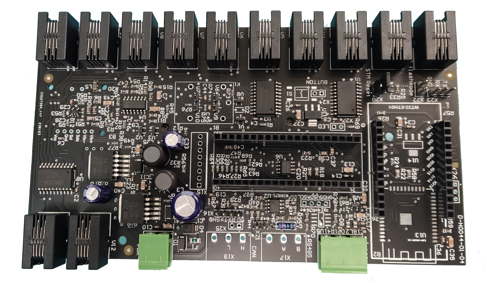

# VdMot_Controller
This is a controller for HmIP-VdMot actuators.

It controls up to 12 HmIP-VdMot actuators or other DC motor valves and is based on custom hardware/software.

It's an alternative to the original HmIP-FALMOT-C12 hardware.
My intention was to create a cheap solution to operate my 18 valves (floor heating + radiators).
I wanted a pure offline system (no cloud connection) and to be free of the constraint to use further components like CCU2/CCU3.

**Hardware for VdMot_Controller is available at Tindie: https://www.tindie.com/products/lenti/vdmot_controller/**

## Features:
- controls up to 12 HmIP-VdMot actuators or other DC motor valves
- learns valve movement by counting motor revolutions based on Back EMF
  - so positioning accuracy should be (very) good
- valve current is evaluated and can be monitored
- interfaces
  - actual: MQTT, JSON
  - optional: MODBUS-RTU via RS485, CAN via external MCP2515
- integrated 1-wire master
  - a lot of additional temperature sensors like DS18B20 could be connected
  - sensor values can be linked to a valve for combined data evaluation
  - usefull for hydraulic balancing ("Hydraulischer Abgleich")
  
## Status
- b-sample hardware is working
- c-sample hardware is working
- c2-sample hardware finished and working
- valve learning, opening and closing is working
- connection to [FHEM](https://fhem.de/) or [IOBroker] established via MQTT
- read and set values via JSON
- first productive test passed
- tests of 2 different actuators done, see [system/actuators.md](./system/actuators.md)
- one wire sensors working
  - sensors can be coupled to a valve
  - therefore the sensor adresses are stored and assigned at startup
- eeprom working
- STM32 can be flashed by ESP32 via WebUI without additional hardware
- simple test of RS485 interface with modbus-rtu master sucessfully performed
- simple test of CAN interface via MCP2515 sucessfully performed
- replaced relay with fet transistors

## Hardware
- find description of hardware here [hardware/hardware.md](./hardware/hardware.md)

## Software
For details please see [software.md](./software.md)
- written in C / C++
- uses great arduino libraries
- developed using PlatformIO
- STM32 BlackPill
  - controls the valves / dc-motors
    - endstop by real current measurement
    - counting motor revolutions by back-EMF
    - state detection
  - controlls 1-wire devices via GPIO
    - optional via DS2482-100 1-wire bus master ic
  - 
- ESP32 / WT32-ETH01
  - communication with MQTT broker or JSON interface
  - visualize system status
    - valve state
    - temperature sensors
    - optional: integrated control algorithm 
  - OTA software update (of ESP32 and STM32)

## License
This project is licensed under the terms of the GNU General Public License v3.0 license.
