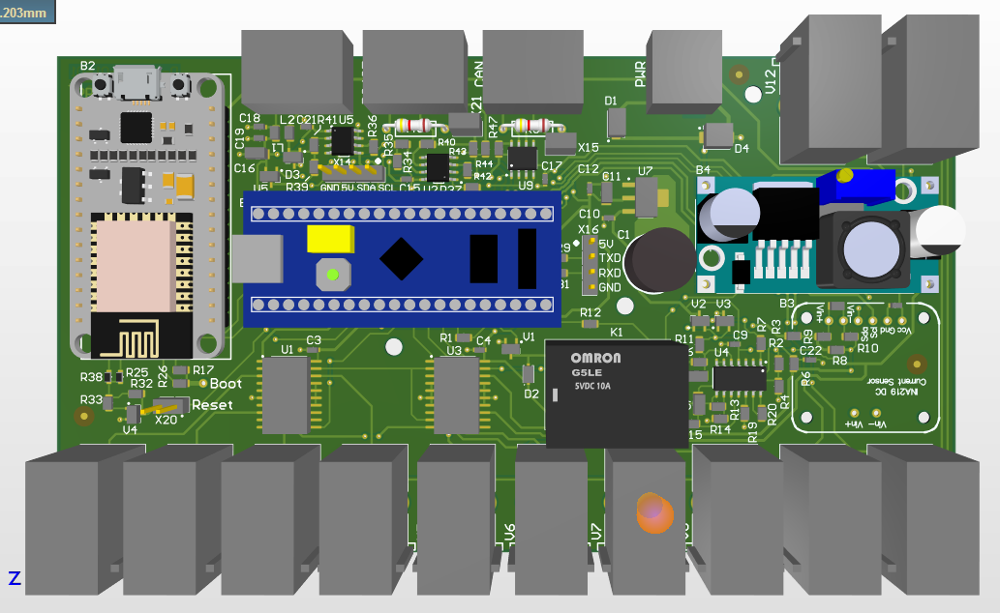

# VdMot_Controller
This is a controller for HmIP-VdMot actuators.

It controls up to 12 HmIP-VdMot actuators or other DC motor valves and is based on custom hardware/software.

It's an alternative to the original HmIP-FALMOT-C12 hardware.
My intention was to create a cheap solution to operate my 18 valves (floor heating + radiators).
I wanted a pure offline system (no cloud connection) and to be free of the constraint to use further components like CCU2/CCU3.

## Features:
- controls up to 12 HmIP-VdMot actuators or other DC motor valves
- learns valve movement by counting motor revolutions based on Back EMF
  - so positioning accuracy should be (very) good
- valve current is evaluated and can be monitored
- interfaces
  - actual: MQTT
  - future: MODBUS, CAN
- integrated 1-wire master
  - a lot of additional temperature sensors like DS18B20 could be connected
  - sensor values can be linked to a valve for combined data evaluation
  - usefull for hydraulic balancing ("Hydraulischer Abgleich")
  
## Status
- b-sample hardware is working with original HmIP-VdMot actuator
- valve learning, opening and closing is working
- connection to [FHEM](https://fhem.de/) established via MQTT
  - topics:
    - /VdMotFBH/valve/x/target      --> set target position for valve (0...100 %)
    - /VdMotFBH/valve/x/actual      --> get actual position of valve (0...100 %) 
    - /VdMotFBH/valve/x/state       --> get actual state of valve (IDLE, OPENING, CLOSING, BLOCKING, OPENCIRCUIT, UNKNOWN)
    - /VdMotFBH/valve/x/meancur     --> get mean current of valve (mA)
    - /VdMotFBH/valve/x/temperature --> get temperature of linked 1-wire sensor (1/10 °C)
    - x = valve number
- first productive test planned for the next weeks

## Hardware
- uC STM32F103C8 on BluePill board
- INA219 current sensor
- L293D for motorcontrol
- back EMF circuit to identify a single commutator switch
  - many thanks to Yi Yao for his inspiration: [DC Motor Controller and Tachometer](http://yyao.ca/projects/motor_controller_tachometer/)
- interfaces: CAN bus, RS485
- optional: wifi via ESP8266
- optional: 1-wire via DS2482-100
- optional: I2C display
- supply voltage 10...24V
- housing for 35mm DIN rail

PCB 3D: 

## Software
- written in C / C++
- not pretty (yet) ... i'm more the hardware guy ;-)
- uses great arduino libraries
- developed using PlatformIO
- STM32 BluePill
  - controls the valves / dc-motors
    - endstop by real current measurement
    - counting motor revolutions by 
  - controlls DS2482-100 1-wire bus master ic
  - serving simple terminal for debugging purposes
  - future
    - so many things, tbd
- ESP8266
  - communication with MQTT broker
  - future
    - visualize system status
    - json interface
    - OTA software update
    - flash STM32

This project is licensed under the terms of the GNU General Public License v3.0 license.
