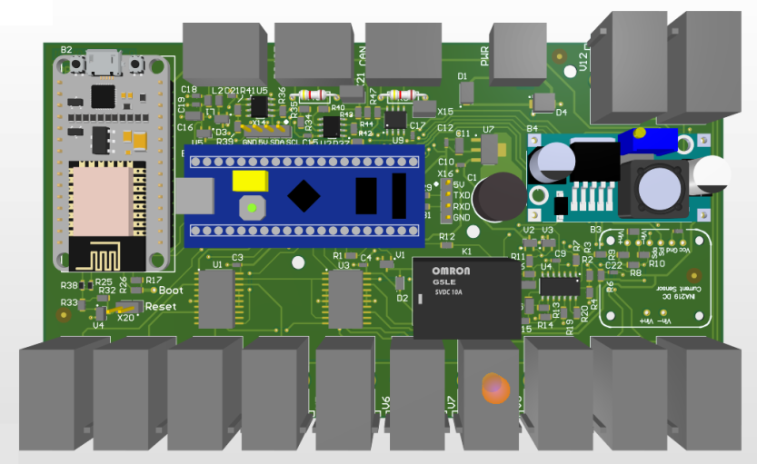

# VdMot_Controller
This is a controller for HmIP-VdMot actuators.

It controls up to 12 HmIP-VdMot actuators and is based on custom hardware.

## Hardware
- uC STM32F103C8 on BluePill board
- INA219 current sensor
- L293D for motorcontrol
- interfaces: CAN bus, RS485
- optional: wifi via ESP8266
- optional: 1-wire via DS2482-100
- supply voltage 10...24V
- housing for 35mm DIN rail

PCB 3D: 

## Software
- tbd

