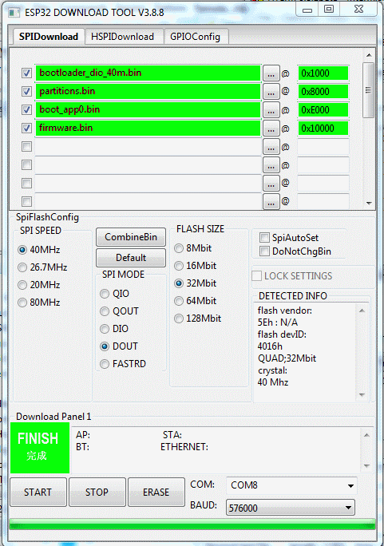
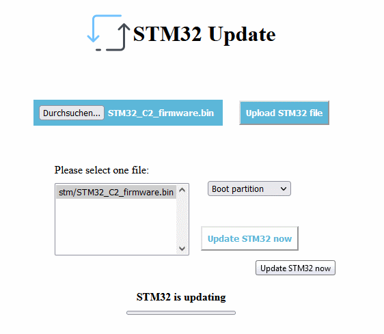

# Board overview

This picture shows essential connectors and jumpers of the VdMot Controller C2 revision Board:

    B1 - BlackPill Board
    B2 - WT32-ETH01 Board

## board versions
Following board versions does exist. The number can be found on the bottom side of the board. For C3 sample it is printed on upper side near WT32-ETH01 module.

    D-H0044-01-02 - C1 sample board - board with 5V relay
    D-H0044-01-03 - C2 sample board - board without need for relay, replaced by transistors
    D-H0044-01-04 - C3 sample board - board without relay, ready for different RJ11 PCB connectors, corrected some imprints

# Software installation
## Initial ESP32 / WT32 Flash via direct upload in Platformio / Visual Studio Code
You will need a USB2UART converter for that step. For example a converter with FTDI FT232 or CH340.

Following configuration of platformio.ini is needed:

    upload_port = COM Port of FTDI Board
    upload_speed = 115200 (or faster)
    
    
Please proceed according following steps:

    1. Connect FT232 to VdMot Controller Board X23 - male header for UART connection
        - X23:Pin1 (GND) -> FT232 GND 
        - X23:Pin2 (RX)  -> FT232 TX 
        - X23:Pin3 (TX)  -> FT232 RX 
    2. Short jumper X22 - this brings ESP32 into flash mode
    3. Power up VdMot Controller
    4. Start upload directly from Platformio in Visual Studio Code. 

## Initial ESP32 / WT32 Flash via Flash Download Tool
You will need a USB2UART converter for that step. For example a converter with FTDI FT232 or CH340.

Following configuration of the flash download tool is needed:

Needed files can be found here: 
https://github.com/Lenti84/VdMot_Controller/blob/master/software_esp32/boot_app0.bin 
https://github.com/Lenti84/VdMot_Controller/blob/master/software_esp32/bootloader_dio_40m.bin 
https://github.com/Lenti84/VdMot_Controller/tree/master/releases/
    
Please proceed according following steps:

    1. Connect FT232 to VdMot Controller Board X23 - male header for UART connection
        - X23:Pin1 (GND) -> FT232 GND 
        - X23:Pin2 (RX)  -> FT232 TX 
        - X23:Pin3 (TX)  -> FT232 RX 
    2. Short jumper X22 - this brings ESP32 into flash mode
    3. Power up VdMot Controller
    4. Click start
    

## Initial STM32 Flash via VdMot Controller
The STM32 can be flashed directly by the ESP32 VdMot Controller.
Proceedure is only needed for the first/initial flashing of the STM32.
After initial steps, flashing can be done fully remote by using the web UI. No need to crawl to the hardware.

Please proceed according following steps:

    1. Short jumper X20 - this allows the ESP32 to Reset STM32 and start the Bootload sequence
    2. Power up VdMot Controller
    3. Open VdMot Controller website and goto "Update"
    4. Click on "Update STM32"
    5. Choose the STM32 firmware file to upload
    6. Click "Upload STM32 file"
    7. Choose Option "boot partition" for initial flashing
    8. After Upload choose correct file in filelist
    9. Press BOOT0 Button at BlackPill Board until flashing progress is >15%
    10. Click "Upload STM32 now"

## Regular STM32 Flash via VdMot Controller
The STM32 can be flashed directly by the ESP32 VdMot Controller.
Flashing can be done fully remote by using the web UI. No need to crawl to the hardware.

Please proceed according following steps:

    1. Jumper X20 has to be shorted
    2. Power up VdMot Controller
    3. Open VdMot Controller website and goto "Update"
    4. Click on "Update STM32"
    5. Choose the STM32 firmware file to upload
    6. Click "Upload STM32 file"
    7. Choose Option "Normal partition" for regular flashing
    8. After Upload choose correct file in filelist
    9. Click "Upload STM32 now"
