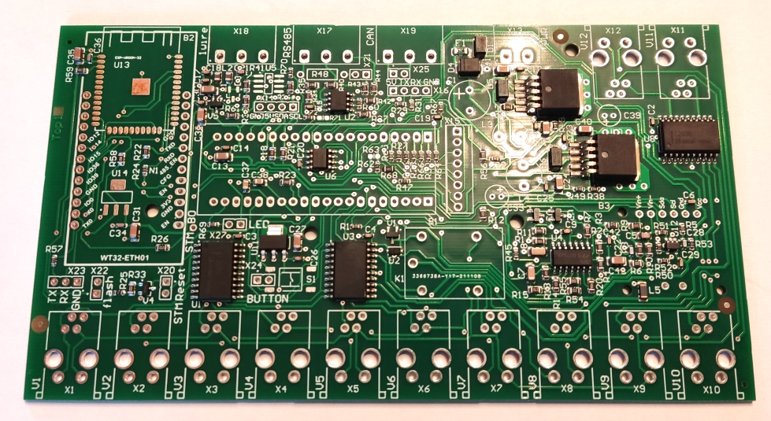
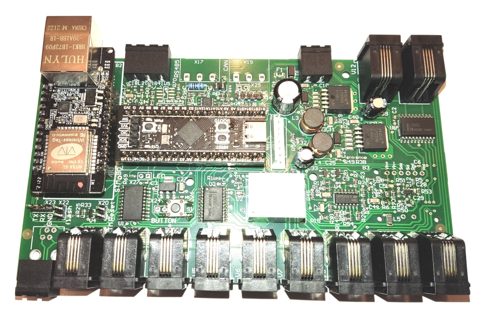
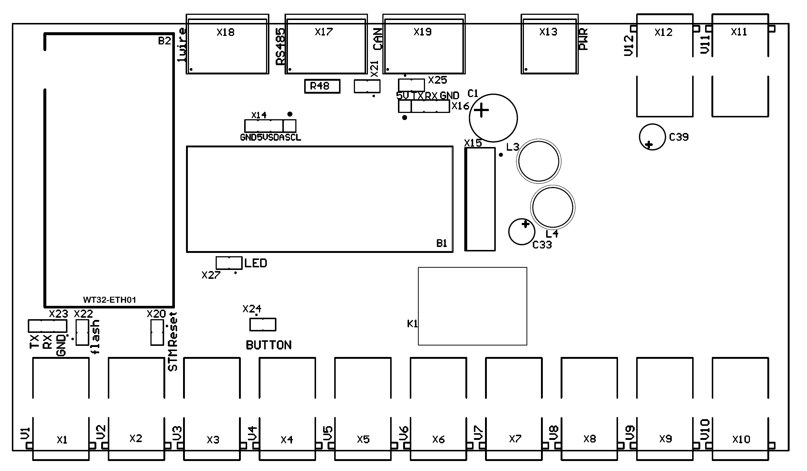
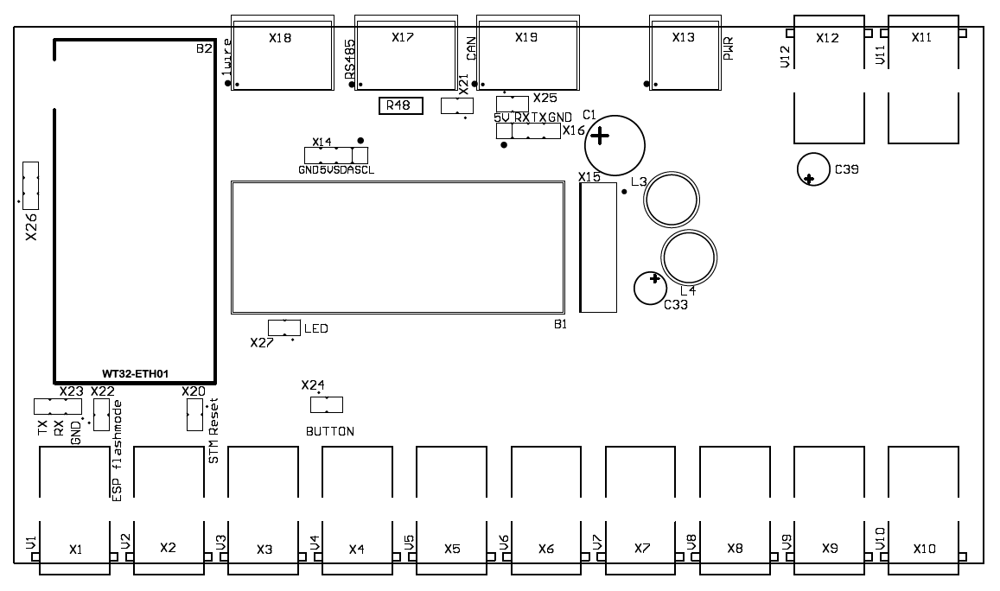

# VdMot_Controller assembly kit

Finally a partly pre-assembled kit of the VdMot_Controller is available.

This site will fill with more and more infos soon...

## pcb numbers
Find pcb number on bottom side of PCB written into copper.
|pcb number|revision|Description|
| --- | --- | --- |
|L-H0044-01-02|C1-sample|first batch|
|L-H0044-01-03|C2-sample|relay replaced by transistors, added X26 (ENA and IO35 pin of ESP32), button switches to 3.3V instead of GND|
|L-H0044-01-04|C3-sample|add support for different RJ10 PCB connectors -> no need for manual rework on suggested housing anymore corrected some imprints|

## schematic
You can find the C1-sample schematic here: [schematic_c-sample_V02.pdf](./schematic_c-sample_V02.pdf)

You can find the C2/C3-sample schematic here: [schematic_c2-sample_V02.pdf](./schematic_c2-sample_V02.pdf)

## pre assembled PCB
You will get a preassembled PCB with all SMT parts assembled. C1-sample shown.

## finished PCB
This is what a assembled PCB (C1-sample) can look like. The ESP32 WT32-ETH01 and STM32 BlackPill board are mounted via female connectors. 

## assembly drawings
Assembly drawing for the THT parts of C1-sample.

Assembly drawing for the THT parts of C2-sample.

## part list for THT parts
Following the part list for the missing components.
|Quantity|Designator|Description|Value|Reichelt order number|
| --- | --- | --- | --- | --- |
|1|C1|capacitor THT RM5 10MM|330µF/35V|NHG-A 330U 35|
|2|C33, C39|capacitor THT RM2 6MM|100µF/25V|NHG-A 100U 25|
|1|U14|3,3V 950mA LOW DROP (1V) FIXED|LD1117S33|NCP 1117 ST33T3G|
|2|X14, X16|male header 4 pins 2.54mm||MPE 087-1-004|
|1|X23, X26|male header 3 pins 2.54mm||MPE 087-1-003|
|5|X20, X21, X22, X24, X25, X27|male header 2 pins 2.54mm||MPE 087-1-002|
|1|R48|resistor 0207 600mW|120R|METALL 120|
|12|X1, X2, X3, X4, X5, X6, X7, X8, X9, X10, X11, X12|4P4C RJ10 Modular Jack||MEBP 4-4S|
|2|L3, L4|ferrit housing 07 radial HCP|330 µH|L-07HCP 330µ|
|1|K1|common relay with 1 CO, example Songle SRD or Omron G5LE|only for C1-sample needed|FIN 36.11 5V|
|1|U5|single-Channel 1-Wire Master||DS 2482-100S|
|3|X17, X18, X19|modular terminal 3 pins RM 5.08||CTB9359-3|
|3|for X17, X18, X19|screw terminal connector 3 pins||CTB9209-3|
|1|X13|modular terminal 2 pins RM 5.08||CTB9359-2|
|3|for X13|screw terminal connector 2 pins||CTB9209-2|
|2|for BlackPill board|female header 20 pin||BL 1X20G8 2,54|
|2|for WT32-ETH01 board|female header 20 pin -> cut to 13 pins||BL 1X20G8 2,54|
|1||DIN rail housing|apra Rail DB 449-370-55|APRA DB9 GBK|
|1|B1|BlackPill STM32F401CCU6||-|
|1|B2|WT32-ETH01||-|
