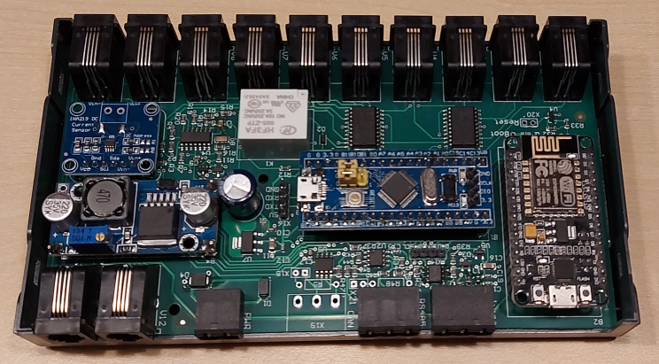

# Hardware

## C-sample -in progress-
- uC STM32F401CCU on BlackPill board
  - I ran out of flash on STM32F103 nor it is available as a genuine part anywhere
- WT32-ETH01 module for Ethernet (RJ45) or wifi connection
- current sensing by opamp circuit, optional INA219 current sensor
- L293 for motorcontrol
- back EMF circuit to identify a single commutator switch
- optional CAN bus via MCP2515
- RS485
- 1-wire via DS2482-100
- optional: I2C display (5V)
- supply voltage 10...24V
- LM2596 step-down converter integrated
- power savings: all three L293 can be switched off by software 

PCB 3D teaser: 

## B-sample
- uC STM32F103C8 on BluePill board
- INA219 current sensor
- L293 for motorcontrol
- back EMF circuit to identify a single commutator switch
  - many thanks to Yi Yao for his inspiration: [DC Motor Controller and Tachometer](http://yyao.ca/projects/motor_controller_tachometer/)
- interfaces: CAN bus, RS485
- wifi via ESP8266
- 1-wire via DS2482-100
- optional: I2C display
- supply voltage 10...24V

You can find the b-sample schematic here: [schematic_b-sample_V02.pdf](./schematic_b-sample_V02.pdf)

BOM: [b-sample BOM](https://htmlpreview.github.io/?https://github.com/Lenti84/VdMot_Controller/blob/master/hardware/bom.htm)

PCB 3D: 

B-sample integration: 

## housing
- apra Rail DB 449-370-55
- housing for 35mm DIN rail
- only small rework needed, 2 mm cutback for RJ11 needed

housing: 
