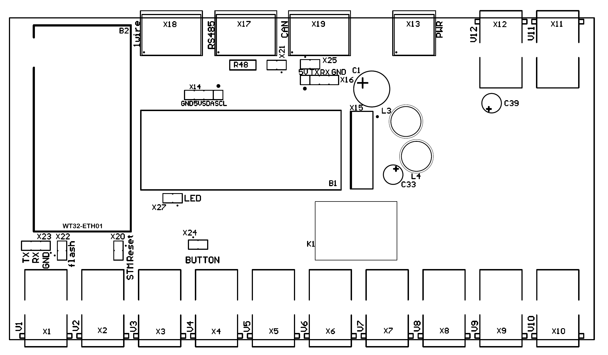

# Hardware

# Init Flash WT32

X22 - Jumper set for init flash

X23 - male header for UART connection

    GND -> GND 
    TX  -> TX 
    RX  -> RX 

# Init Flash STM

X20 - Jumper set for STM Reset, needs for flash STM

Option "boot partition" 
Press - BOOT0 Button at BlackPill Board

Start Init Flash

# Update WT32

# Update STM

Debuggen FTDI

Debuggen STLinks V2