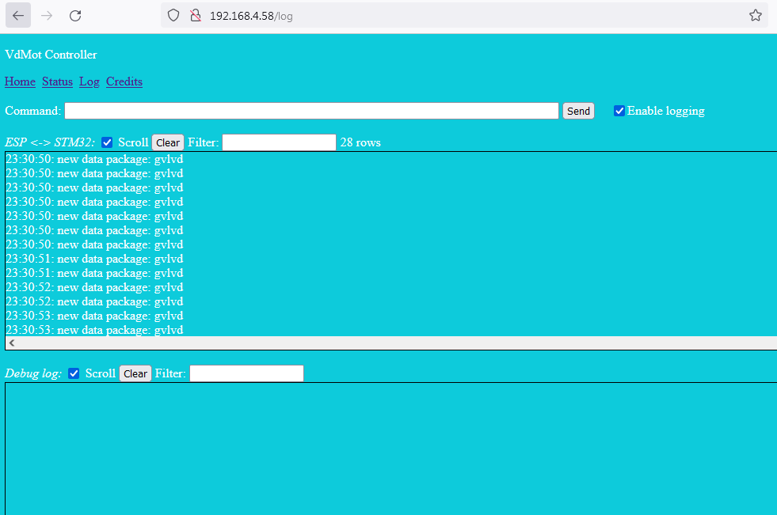

This page will document the software part of the VdMot_Controller.

# ESP32
## Feature list software
- login page
- status page
  - valves: index, description, position, mean current, status, assigned temperature sensor with temperature value, calibration counter
  - temperature sensors: description, temperature, index
- setup page
  - network interface: wifi or ethernet (RJ45)
  - wifi: user and password
  - valves: description/name, assignment of temperature sensor, calibration request
  - temperature sensors: description/name
  - mqtt: server ip, server port, main topic
  - settings: save, recover
- debug page
  - log communication stm32 and esp32
  - log internal messages
  - test command interface
- flash / ota page
  - flash STM32 by file upload
  - flash ESP32 by file upload or direct communication to PlatformIO

## Status
- simple status page  
  
- simple logger page  
  
