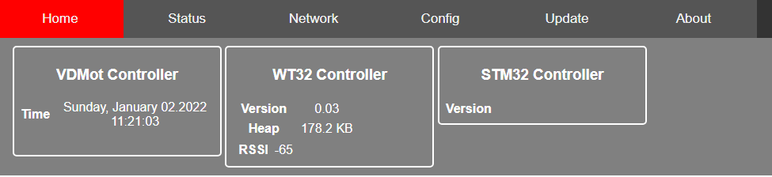
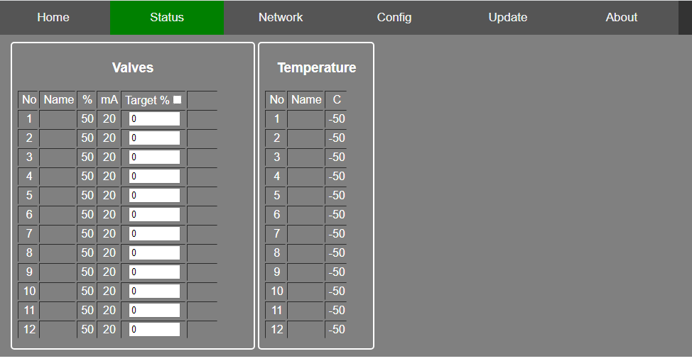
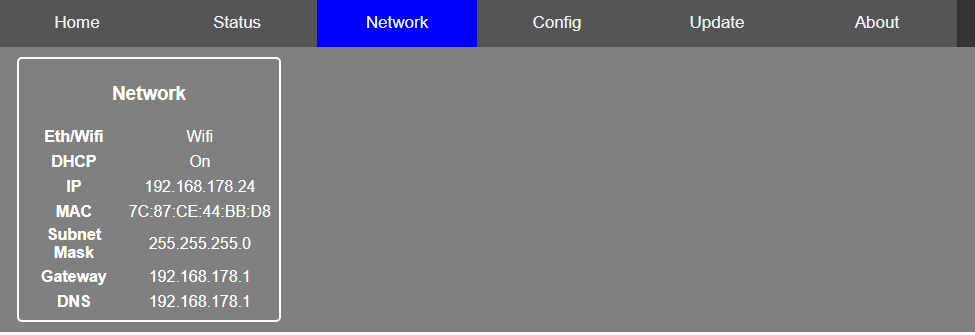
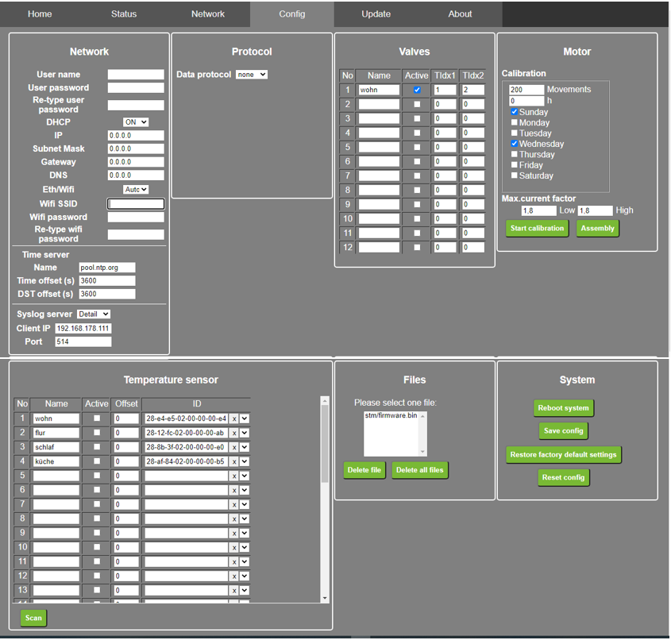
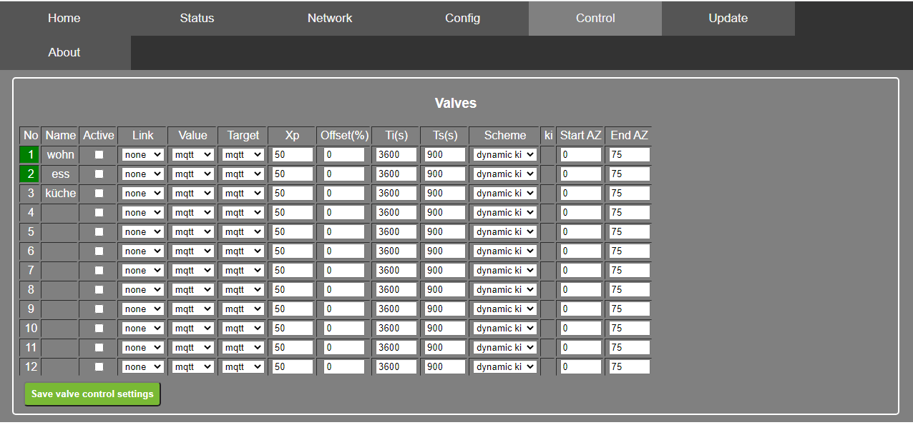
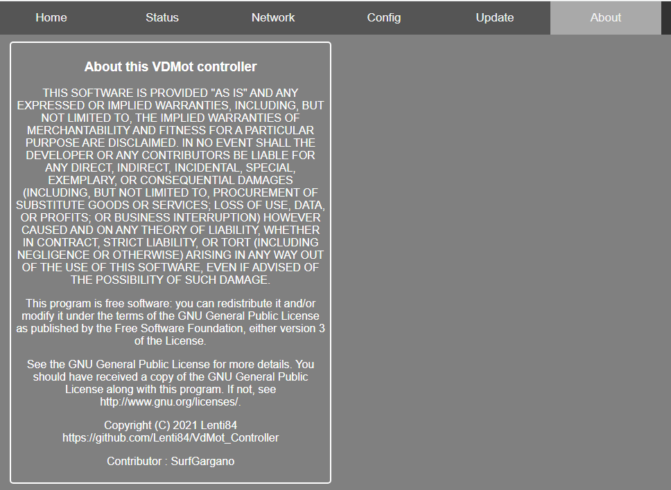
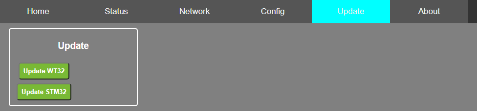
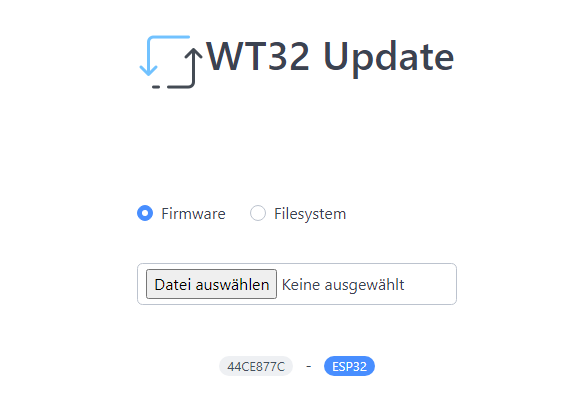
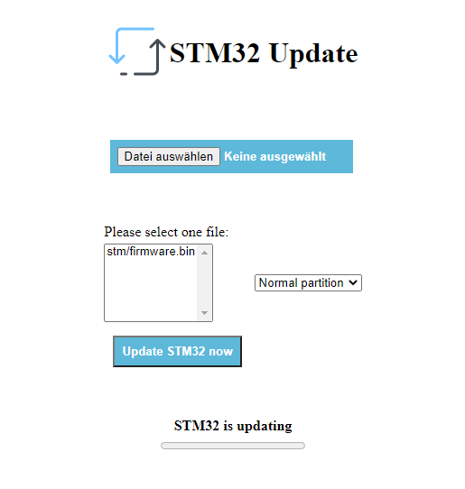

# This page will document the software part of the VdMot_Controller

## ESP32

## Feature list software

- responsive design
- user login
- status page
  - valves: index, description, position, mean current, status, assigned temperature sensor with temperature value
  - temperature sensors: description, temperature, index
- setup page
  - network interface: wifi or ethernet (RJ45)
  - wifi: user and password
  - valves: description/name, assignment of temperature sensor, calibration request
  - temperature sensors: description/name
  - mqtt: server ip, server port, user name and password
  - settings: save, recover
- control page
  - integrated software PI-controller for valves
  - gets target and actual temperature via MQTT/JSON/1-wire
- update page
  - flash STM32 by file upload
  - flash ESP32 by direct send chunks

## ESP32 user interface

- home page  
  
- status page  
  
- network page  
  
- config page  
  
- setup valve control page  
  
- about page  
  
- update page  
  
- esp32 update page  
  
- stm32 update page  
  

## JSON Interface WTH32

### WTH32 supports following commands

### Get

#### "/valves" : read the values of all connected valves

|command|description|units|
|---|---|---|
|"idx"|Index of the valve|0..11
|"name"|Name of the valve defined in config
|"state"|State of the config
|"pos"|Actual position|0..100%
|"meanCur"|Average current of the valve|mA
|"targetPos"|Target position|0..100%
|"temp1"|Temperature of assigned channel 1, send only if assigned|°C
|"temp2"|Temperature of assigned channel 2, send only if assigned|°C

#### "/temps" : read all the temperatures values, except assigned to a valve

|command|description|units|
|---|---|---|
|"id"|Index of the valve|0..33
|"name"|Name of the sensor defined in config
|"temp"|Temperature of the sensor|°C

#### "/netinfo" : read the network info

|command|description|units|
|---|---|---|
|"ethWifi"|detected lan interface| 0 = eth, 1 = wifi
|"dhcp"|DHCP detected| 0 = no, 1 = yes
|"ip"|Ip address of the system
|"mac"|MAC address of the system
|"mask"|Mask Ip of the system
|"gw"|Gateway of the system
|"dns"|DNS Server of the system

#### "/sysinfo" : read the static system info

|command|description|units|
|---|---|---|
|"wt32version"|Version of the WTH32 software
|"wt32cores"|Number of WTH32 cores
|"wt32coreRev"|Revision of the WTH32 cores
|"stm32version"|Version of the STM32 software

#### "/sysdyninfo" : read the dynamic system info

|command|description|units|
|---|---|---|
|"locTime"|Location time
|"heap"|Free heap memory|KBytes
|"wifirssi"|RSSI of wifi
|"wifich"|WiFi channel
|"stmStatus"|Status of the STM32

#### "/netconfig" : read the network configuration

|command|description|units|
|---|---|---|
|"ethWifi"|Configuration lan interface|0 = Auto, 1= Eth, 2=Wifi
|"dhcp"|DHCP enable|0 = disable, 1 = enable
|"ip"|Local Ip address if dhcp not enabled
|"mask"|Mask Ip of the system
|"gw"|Gateway of the system
|"dns"|Dns server of the system
|"userName"|Username if login required
|"ssid"|SSID if wifi selected
|"timeServer"|Url of the sntp server or pool
|"timeOffset"|Time offset of zone|seconds
|"timeDST"|Daylight saving time|0 = off, 1 = on
|"syslogLevel"|Level of the syslog|0 = Off, 1 = Small, 2 = Detail, 3 = Atomic
|"syslogIp"!Ip address of the syslog client
|"syslogPort"|:Port of the syslog client

#### "/protconfig" : read the protocol configuration

|command|description|units|
|---|---|---|
|"prot"|Kind of protocol|0 = off, 1 = Mqtt
|"ip"|Ip address of protocol client
|"port"|Port of the protocol client
|"interval"|Interval transfer data|ms
|"pubTarget|Transfer target data|0  = no, 1 = yes
|"user"|Username if authorization required

#### "/valvesconfig" : read the valves configuration

|command|description|units|
|---|---|---|
|"calib"|Calibration data
|"dayOfCalib"|Days of calibration|Bit 0 = Sunday, Bit 1 = Monday, Bit 2 = Tuesday, Bit 3 = Wednesday, Bit 4 = Thursday, Bit 6 = Friday, Bit 7 = Saturday
|"hourOfCalib"|Hour of calibration
|"cycles"|Number of movements of the motor to start the calibration
|"motor"|Characteristics of the motor
|"lowC"|Max. current value of low position
|"highC"|Max. current value of high position
|"valves"|Array of valve configuration
|"name"|Name of the valve
|"active"|Activate the valve
|"tIdx1"|Index 1 of the assigned temperature sensor|1..34, 0 = not assigned
|"tIdx1"|Index 2 of the assigned temperature sensor1..34, 0 = not assigned

#### "/tempsconfig" : read the temps configuration

|command|description|units|
|---|---|---|
|"name"|Name of the sensor
|"active"|Activate the sensor
|"id"|Sensor id
|"offset"|Offset, will be added to the measured value|°C

### Post

You can use curl to test the communication or set parameters by hand. Example: 
```
curl -H "Content-Type: application/json" -X POST -d '{"pubTarget":0}' http://192.168.123.123/protconfig
```

#### "/netconfig" : saves the network configuration

|command|description|units|
|---|---|---|
|"ethWifi"|Configuration lan interface|0 = Auto, 1= Eth, 2=Wifi
|"dhcp"|DHCP enable|0 = disable, 1 = enable
|"ip"|Local Ip address if dhcp not enabled
|"mask"|Mask Ip of the system
|"gw"|Gateway of the system
|"dns"|Dns server of the system
|"userName"|Username if login required
|"pwd"|Password if login required
|"ssid"|SSID if wifi selected
|"timeServer"|Url of the sntp server or pool
|"timeOffset"|Time offset of zone|seconds
|"timeDST"|Daylight saving time|0 = off, 1 = on
|"syslogLevel"|Level of the syslog|0 = Off, 1 = Small, 2 = Detail, 3 = Atomic
|"syslogIp"|Ip address of the syslog client
|"syslogPort"|:Port of the syslog client

#### "/protconfig" : saves the protocol configuration

|command|description|units|
|---|---|---|
|"prot"|Kind of protocol|0 = off, 1 = Mqtt
|"ip"|Ip address of protocol client
|"port"|Port of the protocol client
|"interval"|Interval transfer data|ms
|"pubTarget|Transfer target data|0  = no, 1 = yes
|"user"|Username if authorization required
|"pwd"|Password if authorization required

#### "/valvesconfig" : saves the valves configuration

|command|description|units|
|---|---|---|
|"calib"|Calibration data
|"dayOfCalib"|Days of calibration|Bit 0 = Sunday, Bit 1 = Monday, Bit 2 = Tuesday, Bit 3 = Wednesday, Bit 4 = Thursday, Bit 6 = Friday, Bit 7 = Saturday
|"hourOfCalib"|Hour of calibration
|"cycles"|Number of movements of the motor to start the calibration
|"motor"|Characteristics of the motor
|"lowC"|Max. current value of low position
|"highC"|Max. current value of high position
|"valves"|Array of valve configuration
|"name"|Name of the valve
|"active"|Activate the valve
|"tIdx1"|Index 1 of the assigned temperature sensor|1..34, 0 = not assigned
|"tIdx1"|Index 2 of the assigned temperature sensor1..34, 0 = not assigned

#### "/tempsconfig" : saves the temps configuration

|command|description|units|
|---|---|---|
|"name"|Name of the sensor
|"active"|Activate the sensor
|"id"|Sensor id
|"offset"|Offset, will be added to the measured value|°C

#### "/cmd" : execute a command

|command|description|units|
|---|---|---|
|example payload : {"action":"reboot"}
|"action"|
|"reboot"|reboots the system
|"saveCfg"|saves the configuration
|"resetCfg"|resets the configuration except network settings
|"restoreCfg"|restore factory settings
|"fDelete":filename|deletes a file
|"clearFS"|delete all files
|"scanTempSensors"|scans the temperature sensors
|"vCalib"|execute the valve calibration
|"vAssembly"|sets all valves to assembly position

***
## MQTT Interface WTH32
Main topic is defined by entry *Config Site -> Network -> Station*.<br/>
Valve Subtopic is defined by entry *Config Site -> Valves -> Name row*.<br/>
Temperature Subtopic is defined by entry *Config Site -> Temperature sensor -> Name row*.<br/>
example: VdMotFloor/valves/Kitchen/target
### following MQTT topics are supported
|topic|direction|description|
|---|---|---|
|maintopic/common|publish|system state of ESP32 - OK 0, Info 1, Error 2|
|maintopic/common/heatControl|subscription|heat control switch: 0 - Manual, 1 - On, 2 - Off, default: 0|
|maintopic/common/parkPosition|subscription|park position: 0...100, default: 10|
|maintopic/valves/valvesubtopic/target|subscription|setpoint for valve position (0...100 %)|
|maintopic/valves/valvesubtopic/target|publish|setpoint for valve position (0...100 %)<br/>only if *Config Site -> Protocol -> Publish -> Target* is checked|
|maintopic/valves/valvesubtopic/tValue|subscription|actual temperature value for integrated valve position control|
|maintopic/valves/valvesubtopic/tTarget|subscription|temperature setpoint for integrated valve position control|
|maintopic/valves/valvesubtopic/actual|publish|actual position of valve (0...100 %)|
|maintopic/valves/valvesubtopic/state|publish|actual state of valve (IDLE, OPENING, CLOSING, BLOCKING, OPENCIRCUIT, UNKNOWN)|
|maintopic/valves/valvesubtopic/meancur|publish|mean current of valve (mA)|
|maintopic/valves/valvesubtopic/temperature|publish|temperature of linked 1-wire sensor (1/10 °C)|
|maintopic/temps/temperaturesubtopic/id|publish|id of 1-wire sensor, 8 byte hex|
|maintopic/temps/temperaturesubtopic/value|publish|temperature of sensor (°C)|

### options
|option|description|
|---|---|
|*Config Site -> Protocol -> Publish -> Target*|publishes target value of valves, please see *hints*|
|*Config Site -> Protocol -> Publish -> All temps*|publishes all 1-wire sensor values even if not linked to a valve|
|*Config Site -> Protocol -> Publish -> Path as root*|publishes an empty topic prior to the maintopic<br/>e.g.: /maintopic/valves/valvesubtopic/...|

### hints
Some MQTT broker dont work with VdMot Controller when publishing and subcribing to the same topic.<br/>
If such problems oocur, please try to uncheck *Config Site -> Protocol -> Publish -> Target*.

***

## command list STM32

## STM32 supports following commands
This commands are send from ESP32 to STM32. The commands can not directly be send by LAN/WiFi.

|command|description|answer|units|comment|
|---|---|---|---|---|
|stgtp x y|set target position of valve *x* to *y* %|-|x=0...11, y=0...100%||
|gtgtp x|get target position of valve *x*|gtgtp *target_position*|0...100%||
|gvlvd x|get data of valve *x*|gvlvd *valve_index position meancurrent status 1st_temperature 2nd_temperature*|*% mA - 1/10°C 1/10°C*||
|stons|start new 1-wire search|-|-|get result via *gonec* and *goned*|
|gonec|get count of 1-wire devices|gonec *count*|*-*||
|goned x|get data (adress and temperature) of 1-wire sensor with index *x*|goned *8ByteHexAddress temperature*|*hex 1/10°C*||
|gvlon x|get 1-wire settings for valve *x*|gvlon *x 8ByteHexAddressFirstSensor 8ByteHexAddressSecondSensor*|*- hex hex*|example: 'gvlon 2 28-84-37-94-97-FF-03-23 00-00-00-00-00-00-00-00 '|
|stsnx x y|set first 1-wire sensor index *y* to valve *x*|-|x=0...11, y=0...33|will be saved in eeprom|
|stsny x y|set second 1-wire sensor index *y* to valve *x*|-|x=0...11, y=0...33|will be saved in eeprom|
|staop x|set valve *x* open|-|0...11, 255|usefull for installation, opens quickly one (x) or all valves (x=255) so they can be mounted|
|staln x|set learning for valve *x*|-|0...11, 255|performs learning cycle for one (x) or all valves (x=255)|
|stlnm x|set learning movement counter|-|0...32000|after x movement requests to valve a new learning cycle will be perfomed|
|stlnt x|set learning time|-|0...1000000|after x seconds a new learning cycle will be perfomed|
|gvers|get version|gvers *version_string*|tbd||
|smotc x y|set motor characteristics: *x* endpoint threshold low (inv), *y* endpoint threshold high|-|x=5...50 y=5...50|endpoint detection will be performed with these current values, will be saved in eeprom|
|gmotc|get motor characteristics|-|*x* endpoint threshold low (inv), *y* endpoint threshold high|see *smotc*|
|stvls|set valve sensors to valve *x*|-|-|example: 'stvls 1 00-00-00-00-00-00-00-00 00-00-00-00-00-00-00-00 '|

## OTA update of ESP32 and STM32

## STM32 OTA

- STM32 can be reset via ESP32 pin
- STM32 BOOT0 pin is not accessible by ESP32 cause of BlackPill board design
- the alternative approach: STM32 jumps to internal bootloader after receiving a magic sequence from ESP32 right after start-up
- idea of general procedure for STM32 update via ESP32
  - ESP32 switches to UART config 9600 8E1 - the even parity is important for STM32 bootloader
  - reset STM32 via ESP32 GPIO
  - STM32 starts up and listens for 2 seconds at UART for magic sequence (UART config: 9600 8E1)
  - ESP32 sends the magic sequence "DEADBEEF"
  - STM32 answers with "BEEFIT"
  - STM32 jumps to internal bootloader
  - ESP32 waits for some time
  - now ESP32 can use STM32 internal bootloader to program it
  - reset STM32 via ESP32 GPIO
  - ESP32 switches back to default UART config 115200 8N1
  - STM32 update finished
