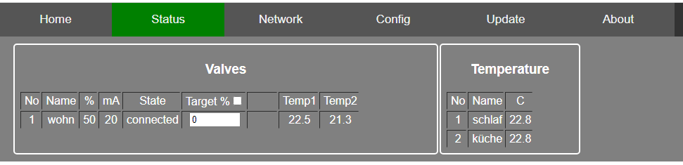

This page will document the software part of the VdMot_Controller.

# ESP32
## Feature list software
- login page
- status page
  - valves: index, description, position, mean current, status, assigned temperature sensor with temperature value, calibration counter
  - temperature sensors: description, temperature, index
- setup page
  - network interface: wifi or ethernet (RJ45)
  - wifi: user and password
  - valves: description/name, assignment of temperature sensor, calibration request
  - temperature sensors: description/name
  - mqtt: server ip, server port, main topic
  - settings: save, recover
- debug page
  - log communication stm32 and esp32
  - log internal messages
  - test command interface
- flash / ota page
  - flash STM32 by file upload
  - flash ESP32 by file upload or direct communication to PlatformIO

## Status
- simple status page  
  
- simple logger page  
  

# OTA update of ESP32 and STM32
## STM32 OTA
- STM32 can be reset via ESP32 pin
- STM32 BOOT0 pin is not accessible by ESP32 cause of BlackPill board design
- the alternative approach: STM32 jumps to internal bootloader after receiving a magic sequence from ESP32 right after start-up
- idea of general procedure for STM32 update via ESP32
  - ESP32 switches to UART config 9600 8E1 - the even parity is important for STM32 bootloader
  - reset STM32 via ESP32 GPIO
  - STM32 starts up and listens for 2 seconds at UART for magic sequence (UART config: 9600 8E1)
  - ESP32 sends the magic sequence "DEADBEEF"
  - STM32 answers with "BEEFIT"
  - STM32 jumps to internal bootloader
  - ESP32 waits for some time
  - now ESP32 can use STM32 internal bootloader to program it
  - reset STM32 via ESP32 GPIO
  - ESP32 switches back to default UART config 115200 8N1
  - STM32 update finished
