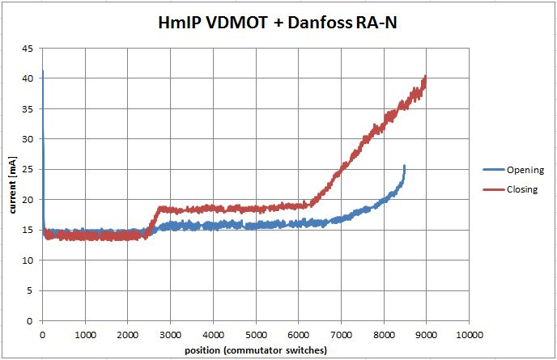
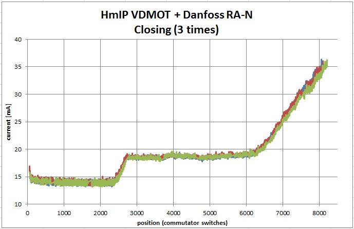
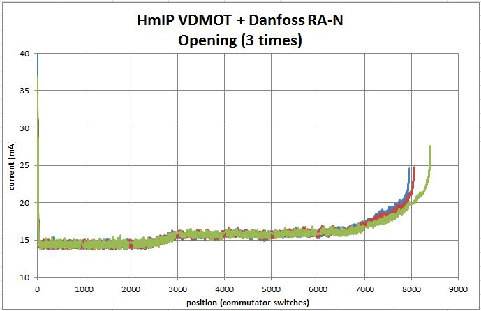
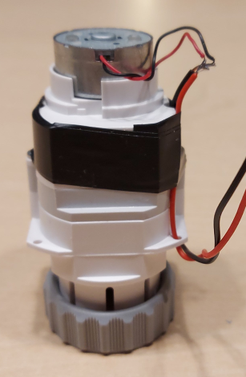
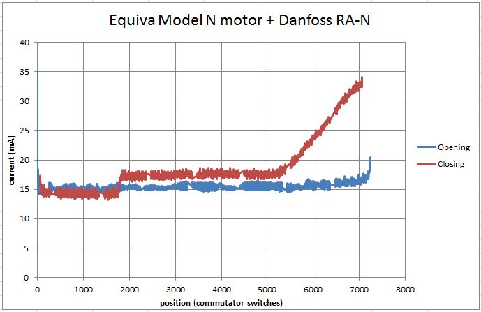

# Actuators
This chapter will give some information about the valves / actuators which were tested with the VdMot Controller.

At the moment I have tested two actuators:
1. HmIP VDMOT
1. Equiva Model N

## HmIP VDMOT
It fits perfecty to the connectors of the VdMot Controller as it was the initial idea provider.

I measured following correlation for the current of the motor in combination with an Danfoss RA-N valve.
The Position is measured by the controller. One step means one commutator switch of the motor.
The counting should be very reliable, so its used as a viable measure for the position of the motor (but not the valve or the flow).

I interpret the current step around position 2600 as the point, where the spindle gets contact with the valve pin.
So compressing the spring and the friction comsumes additionally approximately 4 to 5 mA.
The ramp starting at position 6300 is maybe the phase, where the rubber part of the valve is compressed.
When acting the valve by hand, you can feel a linear phase with nearly constant force and the soft end stop.

Maybe in future software versions it can identify the useful valve range by the current curves / steps.

Additional I measured the closing and the opening with some more cycles:

## Equiva Model N
This is how a dismantled Equiva Model N actuator looks like.  I professionally added some wires for testing.

I measured following correlation for the current of the motor in combination with an Danfoss RA-N valve.

I think this valve could act as a very good replacement for the HmIP VDMOT if not available or if you want to build it very cheap.  
Best price I found in a minute was around 9 €.
